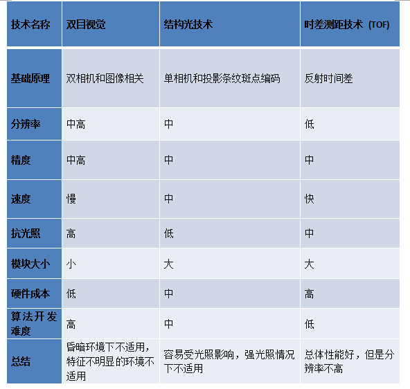
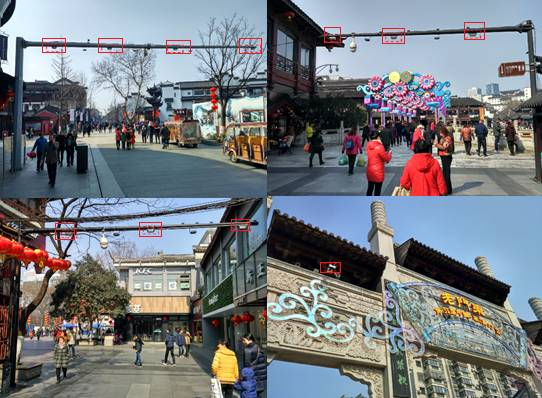
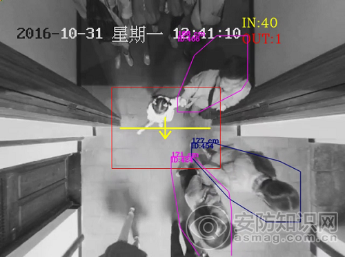
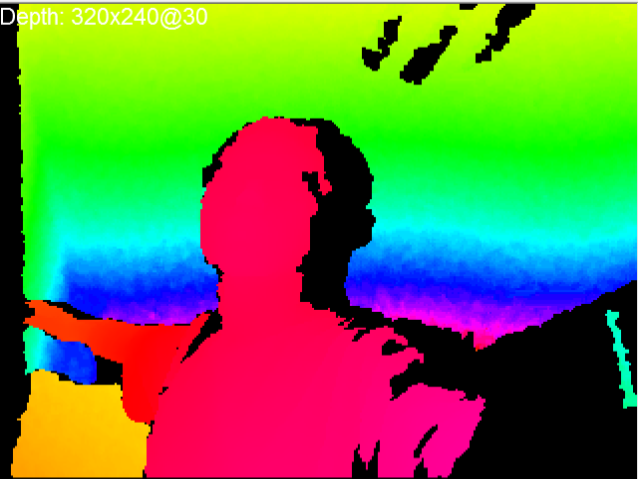

# 二维摄像 + 三维重建法 = 深度视觉摄像

---

---

# 二维摄像

- 结构光方案

    + 原理：通过左右立体像对匹配后，再经过三角测量法来进行立体探测（两角夹一边 -> 确定一个三角形 -> 该三角形的高即为影像点的深度）

    + 优点：
        - 技术成熟，深度图像分辨率可以做得比较高；
        - 价格低廉。
        
    + 缺点：
        - 容易受光照影响，室外环境及夜间环境基本不能使用;
        - 无法得到深度信息。

# 三维重建法
    
- 探针法

    - 时期：早期采用的
    - 特点：简单粗暴
    - 原理：直接手拿定位探针，在物体表面移动，一个点一个点地测坐标
    
- 直接测距法

    + 超声波法
        - 原理：使用特定的人造声源，对物体表面逐点用声程差来测距
    + TOF法
        - 全称：Time of flight，即飞行时间法
        - 原理：采用主动光探测方式，使用特定的人造光源（如红外线），通过入、反射光探测，对物体表面逐点用光程差来测距
        - 运用：
            + 物流行业：通过 TOF 相机迅速获得包裹的抛重（即体积），来优化装箱和进行运费评估
            + 安防和监控：进行 Peoplecounting 确定进入人数不超过上限；通过对人流或复杂交通系统的counting，实现对安防系统的统计分析设计；敏感地区的检测对象监视；机器视觉：工业定位、工业引导和体积预估；替代工位上占用大量空间的、基于红外光进行安全生产控制的设备；
            + 机器人：在自动驾驶领域提供更好的避障信息；机器人在安装、质量控制、原料拣选应用上的引导； 
            + 医疗和生物：足部矫形建模、病人活动/状态监控、手术辅助、面部3D 识别；
            + 互动娱乐：动作姿势探测、表情识别、娱乐广告
                
        - 优点：
            + 视角更宽；
            + TOF相机体积小巧，跟一般相机大小相去无几，非常适合于一些需要轻便、小体积相机的场合；
            + TOF相机能够实时快速的计算深度信息，达到几十到100fps；
            + TOF的深度计算不受物体表面灰度和特征影响，可以非常准确的进行三维探测；
            + 深度计算精度不随距离改变而变化，基本能稳定在cm级，这对于一些大范围运动的应用场合非常有意义。
                
        - 缺点：
            + 深度图像分辨率较低，做一些简单的避障和视觉导航可以用，但是要求精度高些的场景就不行；
            + 测量距离较常规测量仪器短，一般不超过 10 米；
            + 测量结果受被测物性质的影响；
            + 大多数机器的测量结果受外界环境干扰较为明显，尤其是受外界光源扰,所以常只用于室内；
            + 系统误差及随机误差对结果影响明显，需要进行后期数据处理；
            + 由于传感器芯片并不成熟，成本很高，实现量产困难。      

- 双目视觉法

    + 原理：通过左右立体像对匹配后，再经过三角测量法来进行立体探测（两角夹一边 -> 确定一个三角形 -> 该三角形的高即为影像点的深度）

    + 运用：大疆无人机用其实现其无人机避障功能
    
    + 优点：
        - 纯双目只需使用两颗普通PRG摄像头，并不涉及光学系统，成本低；
        - 测量距离长。
        
    + 缺点：
        - 需要目标具有良好的特征变化，否则会无法进行深度计算。
        - 双RGB摄像头的纯双目摄像机，继承了普通RGB摄像头的缺点：在昏暗环境下以及特征不明显的情况下并不适用；
        - 双目立体相机需要用到的算法复杂度高，难度很大，处理芯片需要很高的计算性能，处理速度较慢；
        - 双目相机体积较大。
        
    
- SFM法
       
    + 全称：Structure from Motion
    + 原理：输入是一段motion或者一时间系列的2D图群，这里不需要任何相机的信息。在2D图之间找到了匹配的地方，可以推断出相机的各项参数，从时间系列的2D图像中推算3D信息，通过匹配点之间的视差得到相对的深度信息。
    + 运用：“一日之内建好罗马”项目

---

---

# 综述——深度视觉摄像

## 国内三大主流深度摄像头方案

- (单目)结构光
    + 传统摄像机

- 双目视觉(双目可见光/双目RGB)
    + 双目摄像机
	
- TOF飞行时间法
    + 体感摄像机

## 三种主流深度检测技术比较

---

---

# 一些具体运用的demo

## 双目摄像机用于垂直高度过滤技术：　　

&emsp;&emsp;既能准确计算进出人数，又能有效过滤掉干扰物体（如推车、行李箱、人员徘徊、拥挤及躯体重叠、人员经过未进入等，另外用户也需要有特殊应用，比如身高低于1.2米的儿童进出不计数等），使得客流统计准确率号称可以达到97%以上。 　　

&emsp;&emsp;双目立体视觉技术利用双摄像头摄取两幅图像的视差，构建三维场景，在检测到目标后，通过计算图像对应点间位置偏差，获取目标的三维信息，并能以三维立体视角精确区分行人和干扰物体，如推车、行李箱。 

---

## 体感摄像机用于深度检测：

### 以“直方图”效果展示：

&emsp;&emsp;越近，则对应的像素点黄色程度越亮；越远，则对应的像素点黄色程度越暗。

### 以“热度图”效果展示：

&emsp;&emsp;从近到远，对应的像素点颜色变化为： 紫 -> 红 -> 橙 -> 黄 -> 绿 -> 蓝

### 以“灰度图”效果展示：

&emsp;&emsp;越远，则对应的像素点越暗；越远，则对应的像素点越白亮。

---

## 体感摄像机用于动作检测：

---

---
